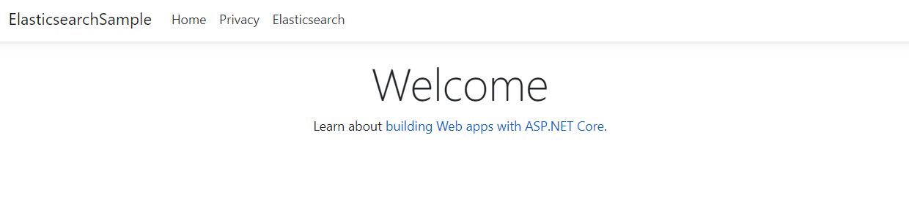
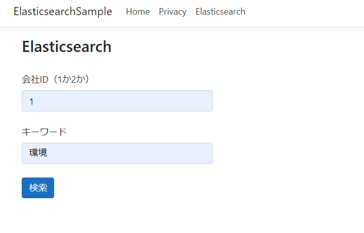
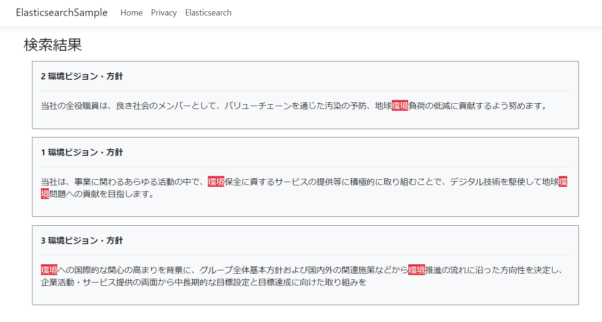

# elasticsearch-sample
Elasticsearchサンプルコード動作環境

## Elasticsearch
docker-composeでElasticsearchコンテナを起動
```
docker-compose build
docker-compose up -d
```

インデックス作成およびデータ流し込み
```
sh sample_esg_index.sh
```

<details><summary>結果を見る</summary><div>

```
{
  "acknowledged" : true,
  "shards_acknowledged" : true,
  "index" : "sample_esg"
}
{
  "acknowledged" : true
}
{
  "sample_esg" : {
    "mappings" : {
      "properties" : {
        "company_id" : {
          "type" : "long"
        },
        "document_id" : {
          "type" : "keyword"
        },
        "document_name" : {
          "type" : "keyword"
        },
        "fiscal_year" : {
          "type" : "long"
        },
        "text" : {
          "type" : "text"
        }
      }
    }
  }
}
{
  "_index" : "sample_esg",
  "_type" : "_doc",
  "_id" : "4f71SnUBE3EyJyUMDfCE",
  "_version" : 1,
  "result" : "created",
  "_shards" : {
    "total" : 2,
    "successful" : 1,
    "failed" : 0
  },
  "_seq_no" : 0,
  "_primary_term" : 1
}
{
  "_index" : "sample_esg",
  "_type" : "_doc",
  "_id" : "4v71SnUBE3EyJyUMDfC7",
  "_version" : 1,
  "result" : "created",
  "_shards" : {
    "total" : 2,
    "successful" : 1,
    "failed" : 0
  },
  "_seq_no" : 1,
  "_primary_term" : 1
}
{
  "_index" : "sample_esg",
  "_type" : "_doc",
  "_id" : "4_71SnUBE3EyJyUMDfDe",
  "_version" : 1,
  "result" : "created",
  "_shards" : {
    "total" : 2,
    "successful" : 1,
    "failed" : 0
  },
  "_seq_no" : 2,
  "_primary_term" : 1
}
{
  "_index" : "sample_esg",
  "_type" : "_doc",
  "_id" : "5P71SnUBE3EyJyUMDvAA",
  "_version" : 1,
  "result" : "created",
  "_shards" : {
    "total" : 2,
    "successful" : 1,
    "failed" : 0
  },
  "_seq_no" : 3,
  "_primary_term" : 1
}
{
  "_index" : "sample_esg",
  "_type" : "_doc",
  "_id" : "5f71SnUBE3EyJyUMDvAs",
  "_version" : 1,
  "result" : "created",
  "_shards" : {
    "total" : 2,
    "successful" : 1,
    "failed" : 0
  },
  "_seq_no" : 4,
  "_primary_term" : 1
}
```

</div></details>


## ASP NET Coreアプリ
Visual Studioで起動


検索するクエリの情報を入力


Elasticsearchからのレスポンスを整形して表示

